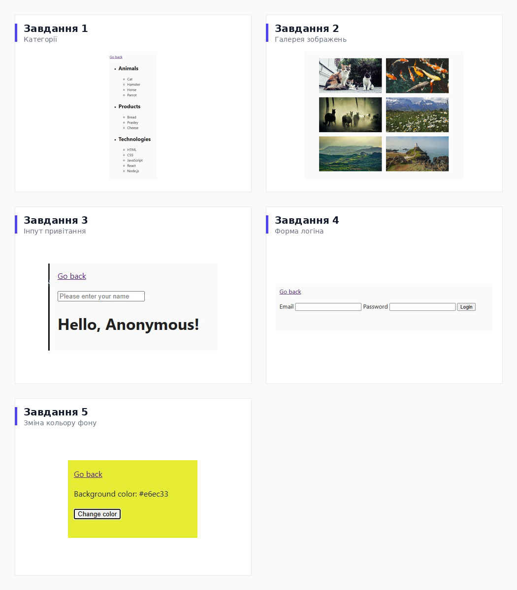

# JavaScript: Manipulación del DOM y Manejo de Eventos

**🌐 Idioma:** [English](./README.md) · [Українська](./README.ua.md) · [Русский](./README.ru.md) · **Español** · [العربية](./README.ar.md)


> Una demostración práctica de las habilidades fundamentales de front-end: **recorrido del DOM, renderizado dinámico, interfaces basadas en eventos, manejo de formularios y validación** — construido íntegramente en JavaScript puro.

🔗 **Demo en vivo:** [mrkorzun.github.io/js-dom-events-playground](https://mrkorzun.github.io/js-dom-events-playground/)



---

## 🎯 Qué demuestra este proyecto

Este repositorio es un portfolio práctico de las habilidades fundamentales de front-end que todo desarrollador junior debe dominar con seguridad, sin depender de frameworks. Cada una de las cinco mini-aplicaciones aborda una habilidad real específica:

| #   | Mini-aplicación              | Habilidad demostrada                                           |
| --- | ---------------------------- | -------------------------------------------------------------- |
| 1   | Inspector de categorías      | Recorrido y análisis del DOM                                   |
| 2   | Galería dinámica de imágenes | Renderizado basado en datos, rendimiento del DOM               |
| 3   | Input de saludo en vivo      | Manejo de eventos en tiempo real, sincronización bidireccional |
| 4   | Formulario de login          | Validación de formularios, recolección estructurada de datos   |
| 5   | Generador de color aleatorio | Estilos inline, actualización de UI por acción del usuario     |

---

## 💡 Habilidades y competencias

### 🔹 JavaScript Puro (ES6+)

Funciones flecha, template literals, destructuring, operador ternario, alcance de `const`/`let`, `String.prototype.trim`, métodos de arrays (`map`, `forEach`, `join`).

### 🔹 Dominio de la API del DOM

- **Selección:** `querySelector`, `querySelectorAll`, `children`
- **Lectura:** `textContent`, `value`, `event.target`
- **Escritura:** `insertAdjacentHTML`, manipulación de `style` inline
- **Rendimiento:** inserción única en el DOM frente a `append` iterativos

### 🔹 Programación basada en eventos

- `addEventListener` para los eventos `input`, `submit` y `click`
- Prevención del comportamiento por defecto mediante `event.preventDefault()`
- Lectura de entradas dinámicas a través de `event.target`

### 🔹 Manejo de formularios

- Acceso a los campos mediante `form.elements` (en lugar de selectores individuales)
- Lógica de validación manual sin el atributo `required`
- Recolección estructurada de datos en un objeto
- Reseteo del estado del formulario con `form.reset()`

### 🔹 Calidad de código y flujo de trabajo

- **Arquitectura modular** — cada tarea aislada en su propio trío HTML/CSS/JS
- **Prettier** para un formato consistente
- **Git** con commits descriptivos y atómicos
- **GitHub Pages** para despliegue continuo

---

## 🧩 Recorrido por las funcionalidades

### 1. Inspector de categorías

Recorre una lista anidada y reporta su estructura por consola — total de categorías, nombre de cada una y cuántos elementos contiene. Demuestra la navegación por el árbol del DOM mediante `children` y la iteración de colecciones con `forEach`.

```
Number of categories: 3
Category: Animals      → Elements: 4
Category: Products     → Elements: 3
Category: Technologies → Elements: 5
```

---

### 2. Galería dinámica de imágenes

Construye una galería completa a partir de un array de datos. Destaca por un **enfoque consciente del rendimiento**: todo el markup se compone en memoria y se inserta en el DOM en **una sola operación**, en lugar de añadir elementos uno por uno en un bucle.

```js
const markup = images
  .map(
    ({ url, alt }) =>
      `<li class="gallery-item"></li>`,
  )
  .join("");

galleryEl.insertAdjacentHTML("beforeend", markup);
```

---

### 3. Input de saludo en vivo

Refleja la entrada del usuario en la página en tiempo real mientras escribe. Implementa un patrón UX defensivo: cuando el campo está vacío o solo contiene espacios, la salida muestra elegantemente `"Anonymous"` en lugar de quedar en blanco.

---

### 4. Formulario de login

Un formulario de login con validación personalizada. El handler de `submit` intercepta el envío predeterminado, verifica manualmente ambos campos y, o bien alerta al usuario sobre campos vacíos, o recolecta los valores ya recortados en un objeto de datos limpio. Demuestra el uso de `form.elements` — la forma idiomática de leer múltiples campos a la vez.

```js
{
  email: "user@example.com",
  password: "secret123"
}
```

---

### 5. Generador de color aleatorio

Con cada clic del botón, genera un color HEX aleatorio, lo aplica como fondo del `<body>` mediante estilo inline y muestra el valor al usuario. Ilustra la manipulación de estilos inline y un patrón limpio de funciones utilitarias.

```js
function getRandomHexColor() {
  return `#${Math.floor(Math.random() * 16777215)
    .toString(16)
    .padStart(6, 0)}`;
}
```

---

## 🚀 Ejecución local

Sin pipeline de build, sin gestor de paquetes, sin dependencias — solo ábrelo.

```bash
git clone https://github.com/mrkorzun/js-dom-events-playground.git
cd js-dom-events-playground
# Abre index.html directamente o usa cualquier servidor estático:
npx serve .
```

Para una experiencia con auto-recarga, se recomienda la extensión **Live Server** para VS Code.

---

## 📁 Estructura del proyecto

```
js-dom-events-playground/
├── css/                    # Estilos por tarea
├── js/                     # Scripts por tarea
├── 01-categories.html      # Mini-aplicación 1
├── 02-gallery.html         # Mini-aplicación 2
├── 03-input.html           # Mini-aplicación 3
├── 04-form.html            # Mini-aplicación 4
├── 05-color.html           # Mini-aplicación 5
├── index.html              # Hub de navegación
└── README.md
```

---

## 👤 Autor

**Romario Korzun** — Front-End Developer

- GitHub: [@mrkorzun](https://github.com/mrkorzun)
- Página personal: [mrkorzun.github.io](https://mrkorzun.github.io)

---

<sub>Originalmente creado como ejercicio práctico dentro del curso **GoIT JavaScript** para consolidar los fundamentos del DOM y el manejo de eventos.</sub>
